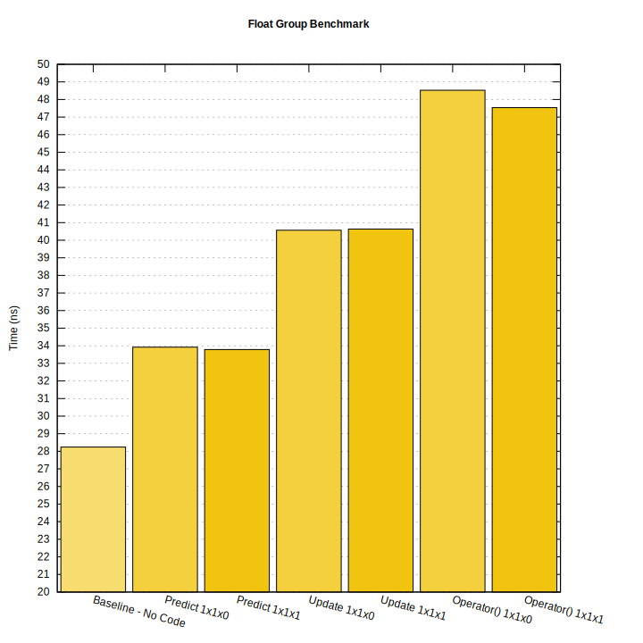

# Kalman Filter for C++

A generic Kalman filter.

The library supports simple and extended filters. The update equation uses the Joseph form. Control input is accepted. Customization point objects allow for using different linear algebra backends for which standard or Eigen3 implementation is provided.

- [Kalman Filter for C++](#kalman-filter-for-c)
- [Examples](#examples)
  - [1x1 Constant System Dynamic Model](#1x1-constant-system-dynamic-model)
  - [6x2 Constant Acceleration Dynamic Model](#6x2-constant-acceleration-dynamic-model)
  - [4x1 Non-Linear Dynamic Model](#4x1-non-linear-dynamic-model)
- [Continuous Integration & Deployment Actions](#continuous-integration--deployment-actions)
- [Class kalman](#class-kalman)
  - [Template Parameters](#template-parameters)
  - [Member Types](#member-types)
  - [Member Functions](#member-functions)
    - [Characteristics](#characteristics)
    - [Modifiers](#modifiers)
- [Format](#format)
- [Installation](#installation)
- [Considerations](#considerations)
  - [Motivations](#motivations)
  - [Selected Tradeoffs](#selected-tradeoffs)
  - [Lessons Learned](#lessons-learned)
  - [Performance](#performance)
- [Resources](#resources)
- [Third Party Acknowledgement](#third-party-acknowledgement)
- [Sponsors](#sponsors)
  - [Corporate Sponsor](#corporate-sponsor)
  - [Named Sponsors](#named-sponsors)
- [License](#license)

# Examples

## 1x1 Constant System Dynamic Model

Example from the building height estimation sample. One estimated state and one observed output filter.

```cpp
kalman k;

k.x(60.);
k.p(225.);
k.r(25.);

k(48.54);
```

## 6x2 Constant Acceleration Dynamic Model

Example from the 2-dimension vehicle location estimation sample. Six estimated states and two observed outputs filter.

```cpp
using kalman = kalman<vector<double, 6>, vector<double, 2>>;

kalman k;

k.x(0., 0., 0., 0., 0., 0.);
k.p(kalman::estimate_uncertainty{ { 500, 0, 0, 0, 0, 0 },
                                  { 0, 500, 0, 0, 0, 0 },
                                  { 0, 0, 500, 0, 0, 0 },
                                  { 0, 0, 0, 500, 0, 0 },
                                  { 0, 0, 0, 0, 500, 0 },
                                  { 0, 0, 0, 0, 0, 500 } });
k.q(0.2 * 0.2 * kalman::process_uncertainty{ { 0.25, 0.5, 0.5, 0, 0, 0 },
                                             { 0.5, 1, 1, 0, 0, 0 },
                                             { 0.5, 1, 1, 0, 0, 0 },
                                             { 0, 0, 0, 0.25, 0.5, 0.5 },
                                             { 0, 0, 0, 0.5, 1, 1 },
                                             { 0, 0, 0, 0.5, 1, 1 } });
k.f(kalman::state_transition{ { 1, 1, 0.5, 0, 0, 0 },
                              { 0, 1, 1, 0, 0, 0 },
                              { 0, 0, 1, 0, 0, 0 },
                              { 0, 0, 0, 1, 1, 0.5 },
                              { 0, 0, 0, 0, 1, 1 },
                              { 0, 0, 0, 0, 0, 1 } });
k.h(kalman::output_model{ { 1, 0, 0, 0, 0, 0 },
                          { 0, 0, 0, 1, 0, 0 } });
k.r(kalman::output_uncertainty{ { 9, 0 }, { 0, 9 } });

k(-375.93, 301.78);
```

## 4x1 Non-Linear Dynamic Model

Example from the thermal, current of warm air, strength, radius, and location estimation sample. Four estimated states and one observed output extended filter with two additional prediction arguments and two additional update arguments.

```cpp
using kalman = kalman<vector<float, 4>, float, void, std::tuple<float, float>,
                             std::tuple<float, float>>;

kalman k;

k.x(1 / 4.06, 80, 0, 0);
k.p(kalman::estimate_uncertainty{ { 0.0049, 0, 0, 0 },
                                  { 0, 400, 0, 0 },
                                  { 0, 0, 400, 0 },
                                  { 0, 0, 0, 400 } });
k.transition([](const kalman::state &x, const float &drift_x,
                const float &drift_y) -> kalman::state {
  return x + kalman::state{ 0, 0, -drift_x, -drift_y };
});
k.q(kalman::process_uncertainty{ { 0.000001, 0, 0, 0 },
                                 { 0, 0.0009, 0, 0 },
                                 { 0, 0, 0.0009, 0 },
                                 { 0, 0, 0, 0.0009 } });
k.r(0.2025);
k.observation([](const kalman::state &x, const float &position_x,
                 const float &position_y) -> kalman::output {
  return kalman::output{ x(0) *
    std::exp(-((x(2) - position_x)*(x(2) - position_x) +
    (x(3) - position_y) * (x(3) - position_y)) / x(1) * x(1)) };
k.h([](const kalman::state &x, const float &position_x,
       const float &position_y) -> kalman::output_model {
  const auto exp{ std::exp(-((x(2) - position_x) * (x(2) - position_x) +
    (x(3) - position_y) * (x(3) - position_y)) / (x(1) * x(1))) };
  const kalman::output_model h{
    exp,
    2 * x(0) * (((x(2) - position_x) * (x(2) - position_x) +
    (x(3) - position_y) * (x(3) - position_y)) / (x(1) * x(1))) * exp,
    -2 * (x(0) * (x(2) - position_x) / (x(1) * x(1))) * exp,
    -2 * (x(0) * (x(3) - position_y) / (x(1) * x(1))) * exp
  };
  return h;
});

k(drift_x, drift_y, position_x, position_y, variometer);
```

# Continuous Integration & Deployment Actions

[](https://github.com/FrancoisCarouge/Kalman)
<br>
[](https://github.com/FrancoisCarouge/Kalman/actions/workflows/verify_test_ubuntu-22-04_gcc-trunk.yml)
<br>
[](https://github.com/FrancoisCarouge/Kalman/actions/workflows/verify_test_windows-2019_msvc.yml)
<br>
[](https://github.com/FrancoisCarouge/Kalman/actions/workflows/verify_test_ubuntu-22-04_clang-trunk.yml)
<br>
<br>
[](https://github.com/FrancoisCarouge/Kalman/actions/workflows/verify_test_sanitizer_undefined_behavior.yml)
<br>
[](https://github.com/FrancoisCarouge/Kalman/actions/workflows/verify_test_sanitizer_thread.yml)
<br>
[](https://github.com/FrancoisCarouge/Kalman/actions/workflows/verify_code_static_analysis_cppcheck.yml)
<br>
[](https://github.com/FrancoisCarouge/Kalman/actions/workflows/verify_code_static_analysis_tidy.yml)
<br>
[](https://github.com/FrancoisCarouge/Kalman/actions/workflows/verify_test_memory_valgrind.yml)
<br>
[](https://github.com/FrancoisCarouge/Kalman/actions/workflows/verify_test_sanitizer_leak.yml)
<br>
[](https://github.com/FrancoisCarouge/Kalman/actions/workflows/verify_code_style_format.yml)
<br>
[](https://github.com/FrancoisCarouge/Kalman/actions/workflows/verify_test_sanitizer_address.yml)
<br>
[](https://coveralls.io/github/FrancoisCarouge/Kalman?branch=develop)
<br>
<br>
[](https://github.com/FrancoisCarouge/Kalman/actions/workflows/verify_documentation_doxygen.yml)
<br>
[](https://raw.githubusercontent.com/francoiscarouge/Kalman/develop/LICENSE.txt)
<br>
[](https://app.fossa.com/projects/git%2Bgithub.com%2FFrancoisCarouge%2FKalman?ref=badge_shield)
<br>
[](http://paypal.me/francoiscarouge)
<br>
<br>
[](https://github.com/FrancoisCarouge/Kalman/actions/workflows/deploy_documentation_doxygen.yml)
<br>
[](https://github.com/FrancoisCarouge/Kalman/actions/workflows/deploy_test_coverage_coveralls.yml)

# Class kalman

A Bayesian filter that uses multivariate Gaussians.

Applicable for unimodal and uncorrelated uncertainties. Kalman filters assume white noise, propagation and measurement functions are differentiable, and that the uncertainty stays centered on the state estimate. The filter updates estimates by multiplying Gaussians and predicts estimates by adding Gaussians. Design the state (X, P), the process (F, Q), the measurement (Z, R), the measurement function H, and if the system has control inputs (U, B). Designing a filter is as much art as science.

Filters with `state x output x input` dimensions as 1x1x1 and 1x1x0 (no input) are supported through the Standard Templated Library (STL). Higher dimension filters require Eigen 3 support.

This class participates in a convenience formatter specialization for formatted string representation of the filter state.

Declared and fully documented in the [fcarouge/kalman.hpp](include/fcarouge/kalman.hpp) header.

```cpp
template <
  typename State,
  typename Output,
  typename Input,
  typename Transpose,
  typename Symmetrize,
  typename Divide,
  typename Identity,
  typename UpdateTypes,
  typename PredictionTypes>
class kalman
```

## Template Parameters

| Template Parameter | Definition |
| --- | --- |
| `State` | The type template parameter of the state column vector x. State variables can be observed (measured), or hidden variables (inferred). This is the the mean of the multivariate Gaussian. Defaults to `double`. |
| `Output` | The type template parameter of the measurement column vector z. Defaults to `double`. |
| `Input` | The type template parameter of the control u. A `void` input type can be used for systems with no input control to disable all of the input control features, the control transition matrix G support, and the other related computations from the filter. Defaults to `void`. |
| `Transpose` | The customization point object template parameter of the matrix transpose functor. Defaults to the standard passthrough `std::identity` function object since the transposed value of an arithmetic type is itself. |
| `Symmetrize` | The customization point object template parameter of the matrix symmetrization functor. Defaults to the standard passthrough `std::identity` function object since the symmetric value of an arithmetic type is itself. |
| `Divide` | The customization point object template parameter of the matrix division functor. Default to the standard division `std::divides<void>` function object. |
| `Identity` | The customization point object template parameter of the matrix identity functor. Defaults to an `identity_matrix` function object returning the arithmetic `1` value. |
| `UpdateTypes` | The additional update function parameter types passed in through a tuple-like parameter type, composing zero or more types. Parameters such as delta times, variances, or linearized values. The parameters are propagated to the function objects used to compute the state observation H and the observation noise R matrices. The parameters are also propagated to the state observation function object h. Defaults to no parameter types, the empty pack. |
| `PredictionTypes` | The additional prediction function parameter types passed in through a tuple-like parameter type, composing zero or more types. Parameters such as delta times, variances, or linearized values. The parameters are propagated to the function objects used to compute the process noise Q, the state transition F, and the control transition G matrices. The parameters are also propagated to the state transition function object f. Defaults to no parameter types, the empty pack. |

## Member Types

| Member Type | Definition | Dimensions |
| --- | --- | --- |
| `estimate_uncertainty` | Type of the estimated covariance matrix P, also known as Σ. | x by z |
| `gain` | Type of the gain matrix K. | x by z |
| `innovation_uncertainty` | Type of the innovation uncertainty matrix S. | z by z |
| `innovation` | Type of the innovation column vector Y. | z by 1 |
| `input_control` | Type of the control transition matrix G, also known as B. | x by u |
| `input` | Type of the control column vector U. | u by 1 |
| `output_model` | Type of the observation transition matrix H, also known as C. | z by x |
| `output_uncertainty` | Type of the observation, measurement noise covariance matrix R. | z by z |
| `output` | Type of the observation column vector Z, also known as Y or O. | z by 1 |
| `process_uncertainty` | Type of the process noise covariance matrix Q. | x by x |
| `state_transition` | Type of the state transition matrix F, also known as Φ or A. | x by x |
| `state` | Type of the state estimate column vector X. | x by 1 |

## Member Functions

| Member Function | Definition |
| --- | --- |
| `(constructor)` | Constructs the filter. |
| `(destructor)` | Destructs the filter. |
| `operator=` | Assigns values to the filter. |

### Characteristics

| Characteristic | Definition |
| --- | --- |
| `f` | Manages the state transition matrix F. Gets the value. Initializes and sets the value. Configures the callable object to compute the value. The default value is the identity matrix. |
| `g` | Manages the control transition matrix G. Gets the value. Initializes and sets the value. Configures the callable object to compute the value. The default value is the identity matrix. |
| `h` | Manages the observation transition matrix H. Gets the value. Initializes and sets the value. Configures the callable object to compute the value. The default value is the identity matrix. |
| `k` | Manages the gain matrix K. Gets the value last computed during the update. The default value is the identity matrix. |
| `p` | Manages the estimated covariance matrix P. Gets the value. Initializes and sets the value. The default value is the identity matrix. |
| `q` | Manages the process noise covariance matrix Q. Gets the value. Initializes and sets the value. Configures the callable object to compute the value. The default value is the null matrix. |
| `r` | Manages the observation, measurement noise covariance matrix R. Gets the value. Initializes and sets the value. Configures the callable object to compute the value. The default value is the null matrix. |
| `s` | Manages the innovation uncertainty matrix S. Gets the value last computed during the update. The default value is the identity matrix. |
| `u` | Manages the control column vector U. Gets the value last used in prediction. |
| `x` | Manages the state estimate column vector X. Gets the value. Initializes and sets the value. The default value is the null column vector. |
| `y` | Manages the innovation column vector Y. Gets the value last computed during the update. The default value is the null column vector. |
| `z` | Manages the observation column vector Z. Gets the value last used during the update. The default value is the null column vector. |
| `transition` | Manages the state transition function object f. Configures the callable object to compute the transition state value. The default value is the equivalent to `f(x) = F * X`. The default function is suitable for linear systems. For extended filters `transition` is a linearization of the state transition while F is the Jacobian of the transition function: `F = ∂f/∂X = ∂fj/∂xi` that is each row i contains the derivatives of the state transition function for every element j in the state column vector X. |
| `observation` | Manages the state observation function object h. Configures the callable object to compute the observation state value. The default value is the equivalent to `h(x) = H * X`. The default function is suitable for linear systems. For extended filters `observation` is a linearization of the state observation while H is the Jacobian of the observation function: `H = ∂h/∂X = ∂hj/∂xi` that is each row i contains the derivatives of the state observation function for every element j in the state vector X. |

### Modifiers

| Modifier | Definition |
| --- | --- |
| `operator()` | Runs a step of the filter. Predicts and updates the estimates per prediction arguments, control input, and measurement output. |
| `update` | Updates the estimates with the outcome of a measurement. |
| `predict` | Produces estimates of the state variables and uncertainties. |

# Format

A specialization of the standard formatter is provided for the filter. Use `std::format` to store a formatted representation of all of the characteristics of the filter in a new string. Standard format parameters to be supported.

```cpp
fcarouge::kalman k;

std::string message{ std::format("{}", k) };
// {"f":1,"h":1,"k":1,"p":1,"q":0,"r":0,"s":1,"x":0,"y":0,"z":0}
```

# Installation

See installation instructions in [INSTALL.txt](INSTALL.txt).

# Considerations

## Motivations

Kalman filters can be difficult to learn, use, and implement. Users often need fair algebra, domain, and software knowledge. Inadequacy leads to incorrectness, underperformance, and a big ball of mud.

This package explores what could be a Kalman filter implementation a la standard library. The following concerns are considered:
- Separation of the application domain and integration needs.
- Separation of the mathematical concepts and linear algebra implementation.
- Generalization of the modern C++ language and library support.

## Selected Tradeoffs

In theory there is no difference between theory and practice, while in practice there is:

- Update and prediction additional arguments are stored in the filter at the costs of memory and performance for the benefits of consistent data access and records.

## Lessons Learned

Design, development, and testing uncovered unexpected facets of the projects:

- The filter's state, output, and input column vectors should be type template parameters to allow the filter to participate in full-compile time verification of unit and index-type safeties.

## Performance

The [benchmarks](benchmark) share some performance information.



# Resources

Awesome resources to learn about Kalman filters:

- [KalmanFilter.NET](https://www.kalmanfilter.net) by Alex Becker.
- [Kalman and Bayesian Filters in Python](https://github.com/rlabbe/Kalman-and-Bayesian-Filters-in-Python) by Roger Labbe.
- [How Kalman Filters Work](https://www.anuncommonlab.com/articles/how-kalman-filters-work) by Tucker McClure of An Uncommon Lab.
- [Wikipedia Kalman filter](https://en.wikipedia.org/wiki/Kalman_filter) by Wikipedia, the free encyclopedia.

# Third Party Acknowledgement

The library is designed, developed, and tested with the help of third-party tools and services acknowledged and thanked here:
- [actions-gh-pages](https://github.com/peaceiris/actions-gh-pages) to upload the documentation to GitHub pages.
- [Clang](https://clang.llvm.org) for compilation and code sanitizers.
- [CMake](https://cmake.org) for build automation.
- [Coveralls](https://coveralls.io) to measure [code coverage](https://coveralls.io/github/FrancoisCarouge/Kalman).
- [cppcheck](https://cppcheck.sourceforge.io) for static analysis.
- [Doxygen](https://doxygen.nl) for documentation generation.
- [GCC](https://gcc.gnu.org) for compilation and code sanitizers.
- [Google Benchmark](https://github.com/google/benchmark) to implement the benchmarks.
- [lcov](http://ltp.sourceforge.net/coverage/lcov.php) to process coverage information.
- [MSVC](https://docs.microsoft.com/en-US/cpp/windows/latest-supported-vc-redist) for compilation and code sanitizers.
- [Valgrind](https://valgrind.org) to check for correct memory management.

# Sponsors

Become a sponsor today! Support this project with coffee and infrastructure!

[](http://paypal.me/francoiscarouge)

## Corporate Sponsor

You company logo and link here!

## Named Sponsors

Your name and link here!

Thanks everyone!

# License


Kalman for C++ is public domain:

This is free and unencumbered software released into the public domain.

Anyone is free to copy, modify, publish, use, compile, sell, or
distribute this software, either in source code form or as a compiled
binary, for any purpose, commercial or non-commercial, and by any
means.

In jurisdictions that recognize copyright laws, the author or authors
of this software dedicate any and all copyright interest in the
software to the public domain. We make this dedication for the benefit
of the public at large and to the detriment of our heirs and
successors. We intend this dedication to be an overt act of
relinquishment in perpetuity of all present and future rights to this
software under copyright law.

THE SOFTWARE IS PROVIDED "AS IS", WITHOUT WARRANTY OF ANY KIND,
EXPRESS OR IMPLIED, INCLUDING BUT NOT LIMITED TO THE WARRANTIES OF
MERCHANTABILITY, FITNESS FOR A PARTICULAR PURPOSE AND NONINFRINGEMENT.
IN NO EVENT SHALL THE AUTHORS BE LIABLE FOR ANY CLAIM, DAMAGES OR
OTHER LIABILITY, WHETHER IN AN ACTION OF CONTRACT, TORT OR OTHERWISE,
ARISING FROM, OUT OF OR IN CONNECTION WITH THE SOFTWARE OR THE USE OR
OTHER DEALINGS IN THE SOFTWARE.

For more information, please refer to <https://unlicense.org>