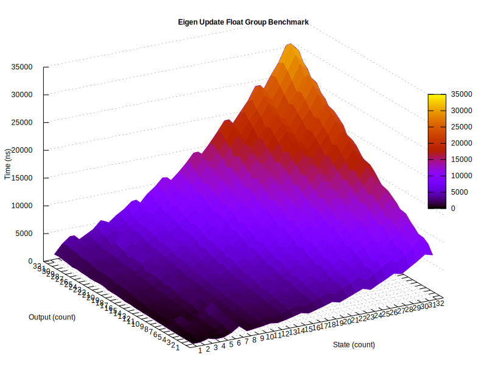
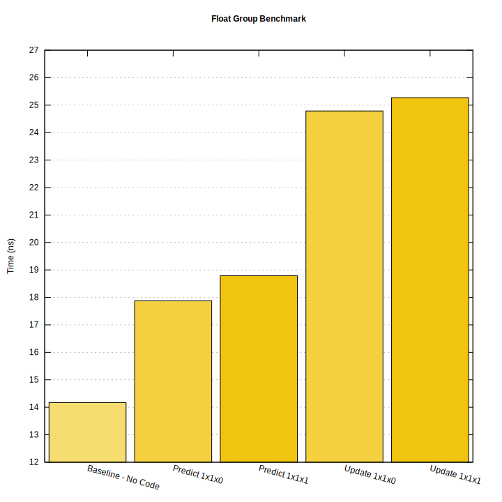

# A Generic Kalman Filter for C++23

The Kalman filter is a Bayesian filter that uses multivariate Gaussians, a recursive state estimator, a linear quadratic estimator (LQE), and an Infinite Impulse Response (IIR) filter. It is a control theory tool applicable to signal estimation, sensor fusion, or data assimilation problems. The filter is applicable for unimodal and uncorrelated uncertainties. The filter assumes white noise, propagation and measurement functions are differentiable, and that the uncertainty stays centered on the state estimate. The filter is the optimal linear filter under assumptions. The filter updates estimates by multiplying Gaussians and predicts estimates by adding Gaussians. Designing a filter is as much art as science. Design the state *X*, *P*, the process *F*, *Q*, the measurement *Z*, *R*, the measurement function *H*, and if the system has control inputs *U*, *G*.

This library supports various simple and extended filters. The implementation is independent from linear algebra backends. Arbitrary parameters can be added to the prediction and update stages to participate in gain-scheduling or linear parameter varying (LPV) systems. The default filter type is a generalized, customizable, and extended filter. The default type parameters implement a one-state, one-output, and double-precision floating-point type filter. The default update equation uses the Joseph form. Examples illustrate various usages and implementation tradeoffs. A standard formatter specialization is included for representation of the filter states. Filters with `state x output x input` dimensions as 1x1x1 and 1x1x0 (no input) are supported through vanilla C++. Higher dimension filters require a linear algebra backend. Customization points and type injections allow for implementation tradeoffs.

- [A Generic Kalman Filter for C++23](#a-generic-kalman-filter-for-c23)
- [Examples](#examples)
  - [1x1 Constant System Dynamic Model Filter](#1x1-constant-system-dynamic-model-filter)
  - [6x2 Constant Acceleration Dynamic Model Filter](#6x2-constant-acceleration-dynamic-model-filter)
  - [4x1 Nonlinear Dynamic Model Extended Filter](#4x1-nonlinear-dynamic-model-extended-filter)
  - [Other Examples](#other-examples)
- [Installation](#installation)
- [Reference](#reference)
  - [Class kalman](#class-kalman)
    - [Declaration](#declaration)
    - [Template Parameters](#template-parameters)
    - [Member Types](#member-types)
    - [Member Functions](#member-functions)
      - [Characteristics](#characteristics)
      - [Modifiers](#modifiers)
  - [Format](#format)
- [Considerations](#considerations)
  - [Motivations](#motivations)
  - [Selected Tradeoffs](#selected-tradeoffs)
  - [Lessons Learned](#lessons-learned)
  - [Performance](#performance)
- [Resources](#resources)
  - [Definitions](#definitions)
  - [Articles](#articles)
- [Continuous Integration \& Deployment Actions](#continuous-integration--deployment-actions)
- [Third Party Acknowledgement](#third-party-acknowledgement)
- [Sponsors](#sponsors)
  - [Corporate Sponsor](#corporate-sponsor)
  - [Named Sponsors](#named-sponsors)
- [License](#license)

# Examples

## 1x1 Constant System Dynamic Model Filter

Example from the [building height estimation](https://francoiscarouge.github.io/Kalman/kf_1x1x0_building_height_8cpp-example.xhtml) sample. One estimated state and one observed output filter.

```cpp
kalman filter;

filter.x(60.);
filter.p(225.);
filter.r(25.);

filter.update(48.54);
```

[full sample code](sample/kf_1x1x0_building_height.cpp)

## 6x2 Constant Acceleration Dynamic Model Filter

Example from the [2-dimension vehicle location, velocity, and acceleration vehicle estimation](https://francoiscarouge.github.io/Kalman/kf_6x2x0_vehicle_location_8cpp-example.xhtml) sample. Six estimated states and two observed outputs filter.

```cpp
using kalman = kalman<vector<double, 6>, vector<double, 2>>;

kalman filter;

filter.x(0., 0., 0., 0., 0., 0.);
filter.p(kalman::estimate_uncertainty{ { 500, 0, 0, 0, 0, 0 },
                                       { 0, 500, 0, 0, 0, 0 },
                                       { 0, 0, 500, 0, 0, 0 },
                                       { 0, 0, 0, 500, 0, 0 },
                                       { 0, 0, 0, 0, 500, 0 },
                                       { 0, 0, 0, 0, 0, 500 } });
filter.q(0.2 * 0.2 * kalman::process_uncertainty{ { 0.25, 0.5, 0.5, 0, 0, 0 },
                                                  { 0.5, 1, 1, 0, 0, 0 },
                                                  { 0.5, 1, 1, 0, 0, 0 },
                                                  { 0, 0, 0, 0.25, 0.5, 0.5 },
                                                  { 0, 0, 0, 0.5, 1, 1 },
                                                  { 0, 0, 0, 0.5, 1, 1 } });
filter.f(kalman::state_transition{ { 1, 1, 0.5, 0, 0, 0 },
                                   { 0, 1, 1, 0, 0, 0 },
                                   { 0, 0, 1, 0, 0, 0 },
                                   { 0, 0, 0, 1, 1, 0.5 },
                                   { 0, 0, 0, 0, 1, 1 },
                                   { 0, 0, 0, 0, 0, 1 } });
filter.h(kalman::output_model{ { 1, 0, 0, 0, 0, 0 },
                               { 0, 0, 0, 1, 0, 0 } });
filter.r(kalman::output_uncertainty{ { 9, 0 }, { 0, 9 } });

filter.predict();
filter.update(-375.93, 301.78);
```

[full sample code](sample/kf_6x2x0_vehicle_location.cpp)

## 4x1 Nonlinear Dynamic Model Extended Filter

Example from the [thermal, current of warm air, strength, radius, and location estimation](https://francoiscarouge.github.io/Kalman/ekf_4x1x0_soaring_8cpp-example.xhtml) sample. Four estimated states and one observed output extended filter with two additional prediction arguments and two additional update arguments.

```cpp
using kalman = kalman<vector<float, 4>, float, void, std::tuple<float, float>,
                             std::tuple<float, float>>;

kalman filter;

filter.x(1 / 4.06, 80, 0, 0);
filter.p(kalman::estimate_uncertainty{ { 0.0049, 0, 0, 0 },
                                       { 0, 400, 0, 0 },
                                       { 0, 0, 400, 0 },
                                       { 0, 0, 0, 400 } });
filter.transition([](const kalman::state &x, const float &drift_x,
                     const float &drift_y) -> kalman::state {
  return x + kalman::state{ 0, 0, -drift_x, -drift_y };
});
filter.q(kalman::process_uncertainty{ { 0.000001, 0, 0, 0 },
                                      { 0, 0.0009, 0, 0 },
                                      { 0, 0, 0.0009, 0 },
                                      { 0, 0, 0, 0.0009 } });
filter.r(0.2025);
filter.observation([](const kalman::state &x, const float &position_x,
                      const float &position_y) -> kalman::output {
  return kalman::output{ x(0) *
    std::exp(-((x(2) - position_x)*(x(2) - position_x) +
    (x(3) - position_y) * (x(3) - position_y)) / x(1) * x(1)) };
filter.h([](const kalman::state &x, const float &position_x,
            const float &position_y) -> kalman::output_model {
  const auto exp{ std::exp(-((x(2) - position_x) * (x(2) - position_x) +
    (x(3) - position_y) * (x(3) - position_y)) / (x(1) * x(1))) };
  const kalman::output_model h{
    exp,
    2 * x(0) * (((x(2) - position_x) * (x(2) - position_x) +
    (x(3) - position_y) * (x(3) - position_y)) / (x(1) * x(1))) * exp,
    -2 * (x(0) * (x(2) - position_x) / (x(1) * x(1))) * exp,
    -2 * (x(0) * (x(3) - position_y) / (x(1) * x(1))) * exp
  };
  return h;
});

filter.predict(drift_x, drift_y);
filter.update(position_x, position_y, variometer);
```

[full sample code](sample/ekf_4x1x0_soaring.cpp)

## Other Examples

- 1x1 constant system dynamic model filter of the [temperature of a liquid in a tank](sample/kf_1x1x0_building_height.cpp).
- 1x1x1 constant velocity dynamic model filter of the [1-dimension position of a dog](sample/kf_1x1x1_dog_position.cpp).
- 2x1x1 constant acceleration dynamic model filter of the [1-dimension position and velocity of a rocket altitude](sample/kf_2x1x1_rocket_altitude.cpp).
- 8x4 constant velocity dynamic model filter of the [2-dimension position and velocity of the center, aspect ratio, and height of a bounding box](sample/kf_8x4x0_deep_sort_bounding_box.cpp).

# Installation

```shell
git clone --depth 1 https://github.com/FrancoisCarouge/kalman.git
cmake -S "kalman" -B "build"
cmake --build "build" --parallel
sudo cmake --install "build"
```

```cmake
find_package(kalman)
target_link_libraries(your_target PRIVATE kalman::kalman)
```

[For more, see installation instructions](INSTALL.md).

# Reference

## Class kalman

Also documented in the [fcarouge/kalman.hpp](include/fcarouge/kalman.hpp) header.

### Declaration

```cpp
template <
  typename State,
  typename Output,
  typename Input,
  typename Divide,
  typename UpdateTypes,
  typename PredictionTypes>
class kalman
```

### Template Parameters

| Template Parameter | Definition |
| --- | --- |
| `State` | The type template parameter of the state column vector *X*. State variables can be observed (measured), or hidden variables (inferred). This is the the mean of the multivariate Gaussian. Defaults to `double`. |
| `Output` | The type template parameter of the measurement column vector *Z*. Defaults to `double`. |
| `Input` | The type template parameter of the control *U*. A `void` input type can be used for systems with no input control to disable all of the input control features, the control transition matrix *G* support, and the other related computations from the filter. Defaults to `void`. |
| `Divide` | The customization point object template parameter of the matrix division functor. Default to the standard division `std::divides<void>` function object. |
| `UpdateTypes` | The additional update function parameter types passed in through a tuple-like parameter type, composing zero or more types. Parameters such as delta times, variances, or linearized values. The parameters are propagated to the function objects used to compute the state observation *H* and the observation noise *R* matrices. The parameters are also propagated to the state observation function object *H*. Defaults to no parameter types, the empty pack. |
| `PredictionTypes` | The additional prediction function parameter types passed in through a tuple-like parameter type, composing zero or more types. Parameters such as delta times, variances, or linearized values. The parameters are propagated to the function objects used to compute the process noise *Q*, the state transition *F*, and the control transition *G* matrices. The parameters are also propagated to the state transition function object *F*. Defaults to no parameter types, the empty pack. |

### Member Types

| Member Type | Dimensions | Definition | Also Known As |
| --- | --- | --- | --- |
| `estimate_uncertainty` | x by x | Type of the estimated covariance matrix `p`. | *P*, *Σ* |
| `gain` | x by z | Type of the gain matrix `k`. | *K* |
| `innovation_uncertainty` | z by z | Type of the innovation uncertainty matrix `s`. | *S* |
| `innovation` | z by 1 | Type of the innovation column vector `y`. | *Y* |
| `input_control` | x by u | Type of the control transition matrix `g`. | *G*, *B* |
| `input` | u by 1 | Type of the control column vector `u`. | *U* |
| `output_model` | z by x | Type of the observation transition matrix `h`. | *H*, *C* |
| `output_uncertainty` | z by z | Type of the observation, measurement noise covariance matrix `r`. | *R* |
| `output` | z by 1 | Type of the observation column vector `z`. | *Z*, *Y*, *O* |
| `process_uncertainty` | x by x | Type of the process noise covariance matrix `q`. | *Q* |
| `state_transition` | x by x | Type of the state transition matrix `f`. | *F*, *Φ*, *A* |
| `state` | x by 1 | Type of the state estimate column vector `x`. | *X* |

### Member Functions

| Member Function | Definition |
| --- | --- |
| `(constructor)` | Constructs the filter. |
| `(destructor)` | Destructs the filter. |
| `operator=` | Assigns values to the filter. |

#### Characteristics

| Characteristic | Definition |
| --- | --- |
| `f` | Manages the state transition matrix *F*. Gets the value. Initializes and sets the value. Configures the callable object of expression `state_transition(const state &, const input &, const PredictionTypes &...)` to compute the value. The default value is the identity matrix. |
| `g` | Manages the control transition matrix *G*. Gets the value. Initializes and sets the value. Configures the callable object of expression `input_control(const PredictionTypes &...)` to compute the value. The default value is the identity matrix. |
| `h` | Manages the observation transition matrix *H*. Gets the value. Initializes and sets the value. Configures the callable object of expression `output_model(const state &, const UpdateTypes &...)` to compute the value. The default value is the identity matrix. |
| `k` | Manages the gain matrix *K*. Gets the value last computed during the update. The default value is the identity matrix. |
| `p` | Manages the estimated covariance matrix *P*. Gets the value. Initializes and sets the value. The default value is the identity matrix. |
| `q` | Manages the process noise covariance matrix *Q*. Gets the value. Initializes and sets the value. Configures the callable object of expression `process_uncertainty(const state &, const PredictionTypes &...)` to compute the value. The default value is the null matrix. |
| `r` | Manages the observation, measurement noise covariance matrix *R*. Gets the value. Initializes and sets the value. Configures the callable object of expression `output_uncertainty(const state &, const output &, const UpdateTypes &...)` to compute the value. The default value is the null matrix. |
| `s` | Manages the innovation uncertainty matrix *S*. Gets the value last computed during the update. The default value is the identity matrix. |
| `u` | Manages the control column vector *U*. Gets the value last used in prediction. |
| `x` | Manages the state estimate column vector *X*. Gets the value. Initializes and sets the value. The default value is the null column vector. |
| `y` | Manages the innovation column vector *Y*. Gets the value last computed during the update. The default value is the null column vector. |
| `z` | Manages the observation column vector *Z*. Gets the value last used during the update. The default value is the null column vector. |
| `transition` | Manages the state transition function object *f*. Configures the callable object of expression `state(const state &, const input &, const PredictionTypes &...)` to compute the transition state value. The default value is the equivalent to *f(x) = F * X*. The default function is suitable for linear systems. For extended filters `transition` is a linearization of the state transition while *F* is the Jacobian of the transition function: *F = ∂f/∂X = ∂fj/∂xi* that is each row *i* contains the derivatives of the state transition function for every element *j* in the state column vector *X*. |
| `observation` | Manages the state observation function object *h*. Configures the callable object of expression `output(const state &, const UpdateTypes &...arguments)` to compute the observation state value. The default value is the equivalent to *h(x) = H * X*. The default function is suitable for linear systems. For extended filters `observation` is a linearization of the state observation while *H* is the Jacobian of the observation function: *H = ∂h/∂X = ∂hj/∂xi* that is each row *i* contains the derivatives of the state observation function for every element *j* in the state vector *X*. |

#### Modifiers

| Modifier | Definition |
| --- | --- |
| `predict` | Produces estimates of the state variables and uncertainties. |
| `update` | Updates the estimates with the outcome of a measurement. |

## Format

A specialization of the standard formatter is provided for the filter. Use `std::format` to store a formatted representation of all of the characteristics of the filter in a new string. Standard format parameters to be supported.

```cpp
kalman filter;

std::print("{}", filter);
// {"f": 1, "h": 1, "k": 1, "p": 1, "q": 0, "r": 0, "s": 1, "x": 0, "y": 0, "z": 0}
```

# Considerations

## Motivations

Kalman filters can be difficult to learn, use, and implement. Users often need fair algebra, domain, and software knowledge. Inadequacy leads to incorrectness, underperformance, and a big ball of mud.

This package explores what could be a Kalman filter implementation a la standard library. The following concerns are considered:
- Separation of the application domain and integration needs.
- Separation of the mathematical concepts and linear algebra implementation.
- Generalization of the modern C++ language and library support.

## Selected Tradeoffs

In theory there is no difference between theory and practice, while in practice there is. The following engineering tradeoffs have been selected for this library implementation:

- Update and prediction additional arguments are stored in the filter at the costs of memory and performance for the benefits of consistent data access and records.
- The default floating point data type for the filter is `double` with about 16 significant digits to reduce loss of information compared to `float`.
- The ergonomics and precision of the default filter takes precedence over performance.

## Lessons Learned

Design, development, and testing uncovered unexpected facets of the projects:

- The filter's state, output, and input column vectors should be type template parameters to allow the filter to participate in full compile-time verification of unit- and index-type safeties for input parameters and characteristics.
- There exist Kalman filters with hundreds of state variables.
- The `float` data type has about seven significant digits. Floating point error is a loss of information to account for in design.

## Performance

The [benchmarks](benchmark) share some performance information. Custom specializations and implementations can outperform this library. Custom optimizations may include: using a different covariance estimation update formula; removing symmetry support; using a different matrix inversion formula; removing unused or identity model dynamics supports; implementing a generated, unrolled filter algebra expressions; or running on accelerator hardware.




# Resources

## Definitions

| Term | Definition |
| --- | --- |
| EKF | The Extended Kalman Filter is the nonlinear version of the Kalman filter. Useful for nonlinear dynamics systems. This filter linearizes the model about an estimate working point of the current mean and covariance. |
| ESKF | The Error State Kalman Filter is the error estimation version of the Kalman filter. Useful for linear error state dynamics systems. This filter estimates the errors rather than the states. 
| UKF | The Unscented Kalman Filter is the sampled version of the Extended Kalman Filter. Useful for highly nonlinear dynamics systems. This filter samples sigma points about an estimate working point of the current mean using an Unscented Transformation technique. |

Further terms should be defined and demonstrated for completeness: CKF, EnKF, Euler-KF, Forward-Backward, FKF, IEKF, Joseph, KF, MEKF, MRP-EKF, MRP-UKF, MSCKF, SKF, Smoother, USQUE, UDU, UT.

## Articles

Resources to learn about Kalman filters:

- [A New Approach to Linear Filtering and Prediction Problems](https://www.cs.unc.edu/~welch/kalman/kalmanPaper.html) by Kalman, Rudolph Emil in Transactions of the ASME - Journal of Basic Engineering, Volume 82, Series D, pp 35-45, 1960 - Transcription by John Lukesh.
- [KalmanFilter.NET](https://www.kalmanfilter.net) by Alex Becker.
- [Kalman and Bayesian Filters in Python](https://github.com/rlabbe/Kalman-and-Bayesian-Filters-in-Python) by Roger Labbe.
- [How Kalman Filters Work](https://www.anuncommonlab.com/articles/how-kalman-filters-work) by Tucker McClure of An Uncommon Lab.
- [Wikipedia Kalman filter](https://en.wikipedia.org/wiki/Kalman_filter) by Wikipedia, the free encyclopedia.
- [Applications of Kalman Filtering in Aerospace 1960 to the Present](https://ieeexplore.ieee.org/stamp/stamp.jsp?tp=&arnumber=5466132) by Mohinder S. Grewal and Angus P. Andrews. IEEE 2010.

## Projects

The library is used in projects:

- [GstKalman](https://github.com/FrancoisCarouge/GstKalman): A GStreamer Kalman filter video plugin.

*Your project link here!*

## Third Party Acknowledgement

The library is designed, developed, and tested with the help of third-party tools and services acknowledged and thanked here:

- [actions-gh-pages](https://github.com/peaceiris/actions-gh-pages) to upload the documentation to GitHub pages.
- [Clang](https://clang.llvm.org) for compilation and code sanitizers.
- [CMake](https://cmake.org) for build automation.
- [cmakelang](https://pypi.org/project/cmakelang) for pretty CMake list files.
- [Coveralls](https://coveralls.io) to measure [code coverage](https://coveralls.io/github/FrancoisCarouge/Kalman).
- [cppcheck](https://cppcheck.sourceforge.io) for static analysis.
- [Doxygen](https://doxygen.nl) for documentation generation.
- [Doxygen Awesome](https://github.com/jothepro/doxygen-awesome-css) for pretty documentation.
- [Eigen](https://eigen.tuxfamily.org/) for linear algebra.
- [GCC](https://gcc.gnu.org) for compilation and code sanitizers.
- [Google Benchmark](https://github.com/google/benchmark) to implement the benchmarks.
- [lcov](http://ltp.sourceforge.net/coverage/lcov.php) to process coverage information.
- [MSVC](https://docs.microsoft.com/en-US/cpp/windows/latest-supported-vc-redist) for compilation and code sanitizers.
- [Valgrind](https://valgrind.org) to check for correct memory management.

## Sponsors

### Corporations & Institutions

*Your group logo and link here!*

### Individuals

*Your name and link here!*

Thanks everyone!

# Continuous Integration & Deployment Actions

[](https://github.com/FrancoisCarouge/Kalman)
<br>
<br>
[](https://github.com/FrancoisCarouge/Kalman/actions/workflows/test_ubuntu-22-04_gcc.yml)
<br>
[](https://github.com/FrancoisCarouge/Kalman/actions/workflows/test_windows-2019_msvc.yml)
<br>
[](https://github.com/FrancoisCarouge/Kalman/actions/workflows/test_ubuntu-22-04_clang.yml)
<br>
<br>
[](https://github.com/FrancoisCarouge/Kalman/actions/workflows/clang_format.yml)
<br>
[](https://github.com/FrancoisCarouge/Kalman/actions/workflows/clang_tidy.yml)
<br>
[](https://github.com/FrancoisCarouge/Kalman/actions/workflows/cmake_format.yml)
<br>
[](https://coveralls.io/github/FrancoisCarouge/Kalman?branch=develop)
<br>
[](https://github.com/FrancoisCarouge/Kalman/actions/workflows/cppcheck.yml)
<br>
[](https://github.com/FrancoisCarouge/Kalman/actions/workflows/sanitizer_address.yml)
<br>
[](https://github.com/FrancoisCarouge/Kalman/actions/workflows/doxygen.yml)
<br>
[](https://github.com/FrancoisCarouge/Kalman/actions/workflows/sanitizer_leak.yml)
<br>
[](https://github.com/FrancoisCarouge/Kalman/actions/workflows/memory_valgrind.yml)
<br>
[](https://github.com/FrancoisCarouge/Kalman/actions/workflows/sanitizer_thread.yml)
<br>
[](https://github.com/FrancoisCarouge/Kalman/actions/workflows/sanitizer_undefined_behavior.yml)
<br>
<br>
[](https://raw.githubusercontent.com/francoiscarouge/Kalman/develop/LICENSE.txt)
<br>
[](https://app.fossa.com/projects/git%2Bgithub.com%2FFrancoisCarouge%2FKalman?ref=badge_shield)
<br>
<br>
[](https://github.com/FrancoisCarouge/Kalman/actions/workflows/deploy_doxygen.yml)
<br>
[](https://github.com/FrancoisCarouge/Kalman/actions/workflows/deploy_test_coverage_coveralls.yml)
<br>
<br>
[](http://paypal.me/francoiscarouge)

# Sponsors

Become a sponsor today! Support this project with coffee and infrastructure!

[](http://paypal.me/francoiscarouge)

# License


Kalman for C++ is public domain:

This is free and unencumbered software released into the public domain.

Anyone is free to copy, modify, publish, use, compile, sell, or
distribute this software, either in source code form or as a compiled
binary, for any purpose, commercial or non-commercial, and by any
means.

In jurisdictions that recognize copyright laws, the author or authors
of this software dedicate any and all copyright interest in the
software to the public domain. We make this dedication for the benefit
of the public at large and to the detriment of our heirs and
successors. We intend this dedication to be an overt act of
relinquishment in perpetuity of all present and future rights to this
software under copyright law.

THE SOFTWARE IS PROVIDED "AS IS", WITHOUT WARRANTY OF ANY KIND,
EXPRESS OR IMPLIED, INCLUDING BUT NOT LIMITED TO THE WARRANTIES OF
MERCHANTABILITY, FITNESS FOR A PARTICULAR PURPOSE AND NONINFRINGEMENT.
IN NO EVENT SHALL THE AUTHORS BE LIABLE FOR ANY CLAIM, DAMAGES OR
OTHER LIABILITY, WHETHER IN AN ACTION OF CONTRACT, TORT OR OTHERWISE,
ARISING FROM, OUT OF OR IN CONNECTION WITH THE SOFTWARE OR THE USE OR
OTHER DEALINGS IN THE SOFTWARE.

For more information, please refer to <https://unlicense.org>