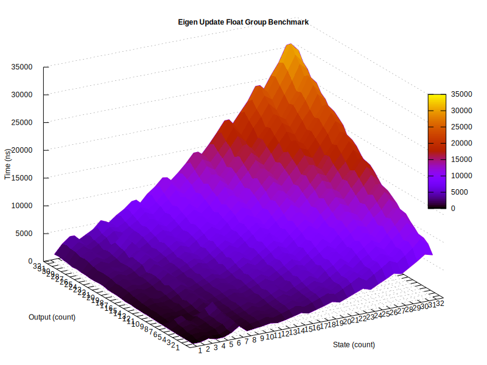
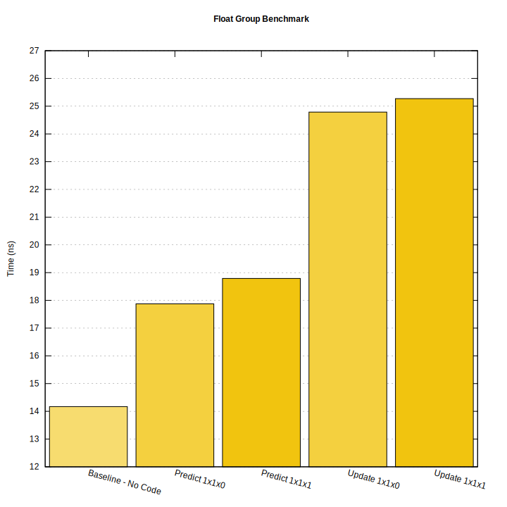

# Benchmarks

Build and run the benchmarks on all platforms:

```shell
git clone --depth 1 https://github.com/FrancoisCarouge/Kalman.git "kalman"
cmake -S "kalman" -B "build" -G "Ninja Multi-Config"
cmake --build "build" --config "Release" --parallel
ctest --test-dir "build" --tests-regex "kalman_benchmark"
```

Plot the results on Linux:

```shell
./kalman/benchmark/script/plot.sh
```

# Results

Run on Microsoft Windows 10 on native x64 with Visual Studio 2022 compiler 19.33 in release mode.






